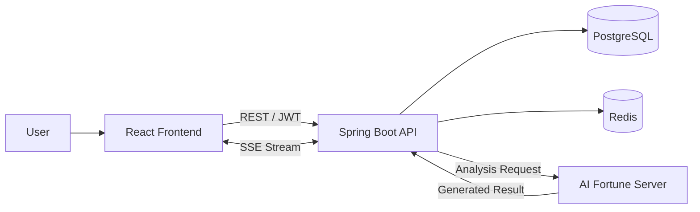

<div align="center">


<br/>


# YEJI

### 동양 사주와 서양 점성술을 하나의 인터랙티브 경험으로 연결한 AI 운세 서비스

[](https://github.com/HWISU96/yeji_frontend)
[](https://github.com/HWISU96/yeji_backend)

</div>

---

## 프로젝트 개요

YEJI는 오늘의 운세, 사주, 타로·화투 카드, 궁합을 동양과 서양의 서로 다른 비주얼과 캐릭터 경험으로 제공하는 웹 서비스입니다.

단순히 결과 텍스트를 보여주는 데 그치지 않고 카드 선택, 캐릭터 대화, 음성·효과음, 단계별 결과 연출을 결합하여 사용자가 운세 콘텐츠에 직접 참여하도록 설계했습니다.

| 구분 | 내용 |
|---|---|
| 프로젝트 형태 | 팀 프로젝트 |
| 개발 기간 | 2026.01 - 2026.02 |
| 담당 역할 | Frontend |
| 주요 기술 | React 19, TypeScript, Vite, Tailwind CSS, Framer Motion |
| 연동 | Spring Boot REST API, SSE, OAuth2, PortOne |

## 담당 범위

공개된 개발 이력을 기준으로 기능 개발·리팩터링 커밋 **45개**, 페이지 모듈 **14개**, API 모듈 **10개**에 참여했습니다.

- 로그인·회원가입, 이메일 인증과 OAuth 로그인
- 마이페이지, 히스토리, 친구, 이벤트, 컬렉션
- 상점·결제와 사용자 보유 재화 연동
- 타로·화투 카드 운세와 단계별 AI 결과 화면
- 친구 및 직접 입력 기반 궁합 분석
- 동양·서양 테마, 캐릭터 상태, 음성·효과음 인터랙션
- 주요 서비스 화면의 반응형 UI

> 백엔드 저장소는 서비스 전체 연동 구조를 확인하기 위한 팀 프로젝트 공개본입니다. 개인 기여 내용은 프론트엔드 저장소와 이 페이지를 기준으로 작성했습니다.

---

## 주요 콘텐츠

<table>
  <tr>
    <td width="50%">
      
    </td>
    <td width="50%">
      
    </td>
  </tr>
  <tr>
    <td align="center"><strong>타로·화투 카드 점괘</strong></td>
    <td align="center"><strong>동양·서양 궁합 분석</strong></td>
  </tr>
</table>

### 인증과 온보딩

- 로그인·회원가입 모드를 하나의 화면 흐름으로 구성
- 이메일·닉네임 중복 검사를 debounce 방식으로 처리
- 인증번호 제한 시간과 비밀번호 조건을 실시간으로 표시
- OAuth 콜백에서 토큰을 저장하고 사용자 상태를 초기화
- Axios interceptor를 통해 인증 헤더와 세션 만료를 공통 처리

관련 코드: [LoginPage.tsx](https://github.com/HWISU96/yeji_frontend/blob/main/src/components/pages/LoginPage.tsx), [OAuthCallback.tsx](https://github.com/HWISU96/yeji_frontend/blob/main/src/components/auth/OAuthCallback.tsx), [axios.ts](https://github.com/HWISU96/yeji_frontend/blob/main/src/api/axios.ts)

### 타로·화투 카드 운세

- `intro → selection → input → card-selection → shuffling → result` 단계 상태 관리
- 서양 타로 3장과 동양 화투 4장의 서로 다른 선택 규칙 구현
- 카드 선택, 셔플, 공개, 개별 해석, 종합 결과를 순차적으로 연출
- AI 응답의 카드 코드·순서·위치가 달라도 화면과 해석이 대응되도록 매핑
- 연애·재물·건강·학업·직장 카테고리별 흐름 제공

관련 코드: [CardReadingPage.tsx](https://github.com/HWISU96/yeji_frontend/blob/main/src/components/pages/CardReadingPage.tsx), [TarotResultView.tsx](https://github.com/HWISU96/yeji_frontend/blob/main/src/components/results/TarotResultView.tsx), [card.ts](https://github.com/HWISU96/yeji_frontend/blob/main/src/api/card.ts)

### 궁합과 서비스 기능

- 친구 목록 선택 또는 생년월일 직접 입력 방식 지원
- 동양·서양 분석 방식 선택과 단계별 로딩 연출
- 궁합 점수와 세부 결과를 시각화하고 히스토리와 연결
- 친구, 이벤트, 컬렉션, 상점, 결제 내역을 백엔드 API와 통합

관련 코드: [CompatibilityPage.tsx](https://github.com/HWISU96/yeji_frontend/blob/main/src/components/pages/CompatibilityPage.tsx), [CollectionPage.tsx](https://github.com/HWISU96/yeji_frontend/blob/main/src/components/pages/CollectionPage.tsx), [ShopPage.tsx](https://github.com/HWISU96/yeji_frontend/blob/main/src/components/pages/ShopPage.tsx)

### 캐릭터 기반 인터랙션

- 동양과 서양을 색상, 배경, 타이포그래피, 캐릭터로 구분
- 캐릭터의 기본·설명·로딩·감정 상태를 사용자 흐름에 맞춰 전환
- 전역 Sound Context로 BGM, 음성, 효과음을 화면 간 일관되게 제어
- Framer Motion을 활용한 카드·모달·페이지 전환 애니메이션 구현
- 데스크톱 중심 화면을 모바일·태블릿에서도 사용할 수 있도록 반응형 개선

---

## 기술적 구현

### 1. SSE 스트리밍 응답 처리

AI 응답이 한 번에 도착하지 않는 운세 대화에서는 `ReadableStream`을 직접 읽고, 네트워크 청크와 실제 SSE 이벤트의 경계가 일치하지 않는 상황을 고려했습니다.

```text
응답 청크 수신
→ 이전 buffer와 결합
→ 빈 줄 기준으로 이벤트 분리
→ 미완성 이벤트는 다음 청크까지 보관
→ data 필드 JSON 변환
→ 화면에 순차 반영
```

관련 코드: [unse.ts](https://github.com/HWISU96/yeji_frontend/blob/main/src/api/unse.ts)

### 2. 단계형 콘텐츠 상태 관리

카드 선택 화면은 한 페이지 안에서 입력, 선택, 셔플, 결과까지 여러 상태를 가집니다. 현재 단계를 명시적인 phase로 관리하고, 동양·서양 콘텐츠별 데이터와 연출을 분리해 복잡한 조건 분기를 통제했습니다.

### 3. AI 응답과 화면 데이터 정합성

AI가 반환한 카드 배열의 순서나 필드 형태가 달라질 수 있어 다음 우선순위로 결과를 매칭했습니다.

1. 카드 코드와 위치가 모두 일치하는 데이터
2. 위치가 일치하는 데이터
3. 응답 배열의 동일 인덱스 데이터

이를 통해 화면의 카드 이미지와 AI 해석이 서로 다른 카드를 가리키는 문제를 줄였습니다.

### 4. 공통 인증 오류 처리

각 페이지에서 401 오류를 따로 처리하지 않고 Axios 응답 interceptor에서 토큰을 제거한 뒤 전역 이벤트를 발행했습니다. App 영역에서는 해당 이벤트를 받아 세션 만료 모달과 로그인 이동을 일관되게 처리합니다.

---

## 시스템 구조



| 영역 | 기술 |
|---|---|
| UI | React 19, TypeScript, Tailwind CSS |
| Interaction | Framer Motion, Three.js, React Three Fiber |
| Data | Axios, Fetch API, SSE |
| Visualization | Recharts |
| Backend | Java 21, Spring Boot, Spring Security |
| Storage | PostgreSQL, Redis |
| Build·Deploy | Vite, Gradle, Docker, Nginx |

---

## 검증

### Frontend

- 프로덕션 빌드 성공
- ESLint 오류 0건
- npm 취약점 0건

### Backend 공개본

- Java 21 빌드 성공
- 통합 테스트 16개 통과
- 공개 이력의 자격 증명과 내부 배포 정보 제거

---

## 저장소

| 저장소 | 설명 |
|---|---|
| [yeji_frontend](https://github.com/HWISU96/yeji_frontend) | 담당 기능과 개발 이력이 포함된 프론트엔드 |
| [yeji_backend](https://github.com/HWISU96/yeji_backend) | 서비스 연동 구조 확인을 위한 팀 백엔드 공개본 |

## 개선 방향

- 인증 토큰을 `HttpOnly`, `Secure`, `SameSite` 쿠키 방식으로 전환
- 대용량 이미지·음원에 지연 로딩과 포맷 최적화 적용
- 페이지 단위 코드 분할로 초기 번들 크기 축소
- SSE parser와 복합 단계 상태에 대한 단위 테스트 보강

---

<div align="center">

일부 이미지와 음원 제작에는 생성형 AI를 활용했습니다.<br/>
이 저장소는 포트폴리오 소개 목적으로 작성되었으며 별도 오픈소스 라이선스를 부여하지 않습니다.

</div>
